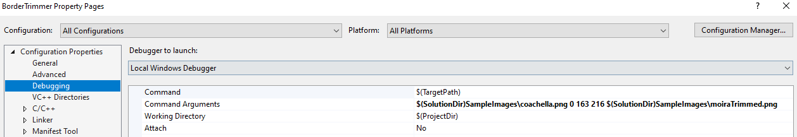
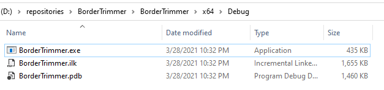
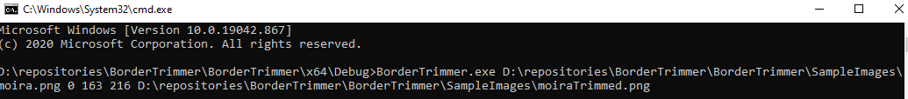

# BorderTrimmer

## Image border trimmer using a line scan based approach

Simple project to remove the borders of an image. The borders must be row/column aligned and they must be of a known RGB color.
A Visual Studio solution is provided along with sample images that can be used as reference.

## Requirements
The Solution was generated using the following tools: 

Microsoft Visual Studio Community 2019
Windows SDK Version 10.0

stb library was used as interface to load/write images in png and jpg formats.
https://github.com/nothings/stb

## Usage
The application receives 5 parameters as input
1. Filepath to the image with border
2. Red value of border color (0-255)
3. Green value of border color (0-255)
4. Blue value of border color (0-255)
5. Filepath to the borderless image

e.g <b>D:\\myFolder\\imageWithBorder.png 100 120 130 D:\\myFolder\\borderlessImage.png</b>

When launching the application inside Visual Studio, it is possible to supply the required command arguments via the solution properties, refer to the image below.

If the application is built, you can locate the executable file in the <b> BorderTrimmer\x64\ </b> and going inside the Release or Debug folder depending of the selected build type

Next open a Windows CMD terminal and proceed to launch the application by typing the desired command, use the following as reference:

The expeced result is shown below:

